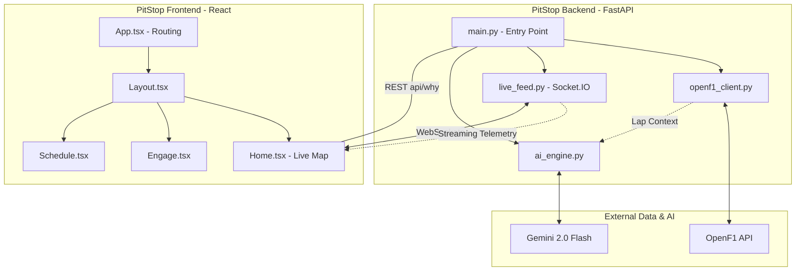

# PitStop F1 Architecture

This document details the system architecture and data flow for the PitStop F1 application.

## System Architecture

## Component Breakdown

### Backend (`/backend`)
- **`main.py`**: The central entry point using FastAPI. It handles REST endpoints (`/api/why`, `/health`) and mounts the Socket.IO application.
- **`openf1_client.py`**: A low-level client for the OpenF1 API. It manages session resolution, driver metadata caching, and builds the GPS-accurate track path.
- **`live_feed.py`**: Manages the real-time Socket.IO server. It polls OpenF1 for car positions, scales the coordinates for the frontend, and broadcasts updates to connected clients.
- **`ai_engine.py`**: Interface for the Gemini 2.0 Flash API. It takes raw race data (lap context) and produces human-readable strategy explanations.

### Frontend (`/src`)
- **`App.tsx`**: Manages top-level state (active screen, selected team) and conditional rendering.
- **`components/Layout.tsx`**: Provides the persistent Sidebar navigation and the main content shell.
- **`components/Home.tsx`**: The primary "Live" view. It connects to the backend via Socket.IO to receive live car positions and renders them on the `TrackMap`.
- **`components/TrackMap.tsx`**: A specialized SVG component that draws the circuit and car icons based on real-time coordinates.
- **`components/Schedule.tsx`**: Fetches and displays the F1 calendar and race details.

## Data Flow
1. **Startup**: The backend resolves the current F1 session and builds a track path from GPS data.
2. **Subscription**: When a user opens the Home screen, the frontend establishes a WebSocket connection to the backend.
3. **Telemetry**: The backend pushes car position updates every ~1-2 seconds.
4. **Insight Request**: When a significant event occurs, the frontend calls the `/api/why` REST endpoint.
5. **AI Reasoning**: The backend fetches relevant lap context, asks Gemini for an analysis, and returns the insight to the user.
